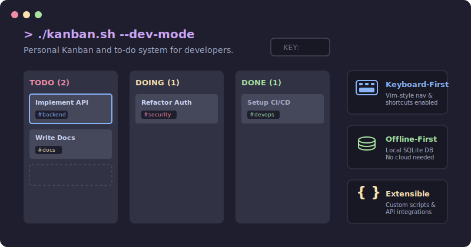

### Software Engineer (Backend/Platform) · Local-first dev tools · Trust-first automation

---

## Start here: Taskdeck 
**Taskdeck** is my local-first execution workspace: capture → **proposal diff** → explicit apply.  
It’s built around **trust-first automation**: reviewable changes, auditability, safe defaults.

- **Stack:** Vue 3 · .NET 8 · SQLite  
- **Target user:** developers who like keyboard-first workflows and low overhead  
- **Why it’s different:** “AI assistance” is *proposal-first*, not autopilot

➡️ **Repo:** https://github.com/Chris0Jeky/Taskdeck

---

## Proof 
- **Enterprise DevOps/security:** integrated automated scanning into **~72 AWS CI/CD pipelines** (Jenkins + Bash/Groovy) — write-up in my portfolio  
- **Research:** published work on multi-agent simulation / game theory (N‑Person Prisoner’s Dilemma)

---

## Projects worth your time
| Project | What it is | Link |
|---|---|---|
| **RepoScope** | Local/offline Git repository analyzer & report generator | https://github.com/Chris0Jeky/RepoScope |
| **NavSentinel** | MV3 browser extension — navigation intent firewall | https://github.com/Chris0Jeky/NavSentinel |
| **DevFoundry** | Offline developer toolbox (CLI + UI, shared core) | https://github.com/Chris0Jeky/DevFoundry |
| **N‑Person IPD Research** | Multi-agent simulation framework + analysis | https://github.com/Chris0Jeky/N-person-prisoners-dilemma-simulation |

---

## What I’m optimizing for
- Building products end-to-end (architecture → CI/testing → release discipline → UX)
- Reliability and security basics as defaults (not “later”)
- Local-first UX where it makes sense (speed, privacy, control)

---

  
<strong>Tech stack </strong>

**Languages:** C#, Java, TypeScript, JavaScript, Python, C++, Bash  
**Backend/Platform:** .NET, Node.js, SQLite/Postgres, Docker  
**Frontend:** Vue 3 (and friends)  
**DevOps:** CI/CD, AWS, Jenkins, container workflows

  
<strong>GitHub stats </strong>

 
 
 
  
 

  

