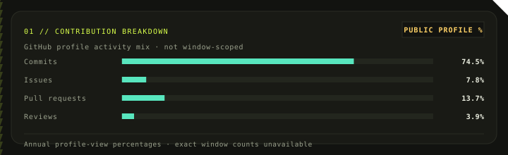
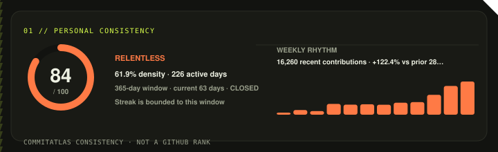
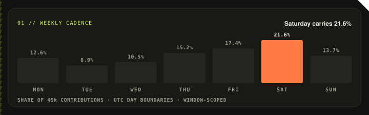
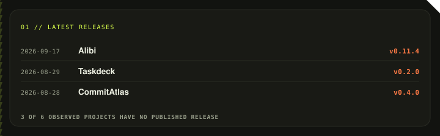

### Backend & platform engineer · Local-first developer tools · Trust-first automation

I build systems that make complex work reviewable, observable, and safe.

[Portfolio](https://chris0jeky.github.io/CV_and_Portfolio/) · [LinkedIn](https://www.linkedin.com/in/cristian-tcaci/) · [Email](mailto:jeky.tck@gmail.com) · [CommitAtlas Studio](https://commit-atlas.commit-atlas.workers.dev/studio)

---

## GitHub operating picture

  <a href="https://commit-atlas.commit-atlas.workers.dev/studio">
    <picture>
      <source media="(prefers-color-scheme: light) and (max-width: 600px)" srcset="./assets/commitatlas/light/atlas-compact.svg" />
      <source media="(max-width: 600px)" srcset="./assets/commitatlas/atlas-compact.svg" />
      <source media="(prefers-color-scheme: light)" srcset="./assets/commitatlas/light/atlas.svg" />
      
    </picture>
  </a>

Daily committed snapshot from GitHub's logged-out public profile view · the signed-in owner's contribution calendar can differ because it may include private activity · exact 365-day window ending on the date printed in the card · no credential or private repository detail requested · a failed refresh keeps the last good snapshot online · <a href="https://commit-atlas.commit-atlas.workers.dev/studio">Open Studio</a> · <a href="https://github.com/Chris0Jeky/CommitAtlas">Source</a>

---

## Now building: Taskdeck

**[Taskdeck](https://github.com/Chris0Jeky/Taskdeck)** is a local-first, review-first action-item engine. It turns notes, emails, and checklists into source-linked proposals; you review the diff, then explicitly apply the changes.

- **Why it exists:** useful automation should preserve human control and provenance.
- **Core loop:** capture → proposal → review → apply.
- **Stack:** C# · .NET 8 · Vue 3 · TypeScript · SQLite.
- **Status:** public beta, with self-contained desktop builds in `v0.1.1`.

**[Download for Windows](https://github.com/Chris0Jeky/Taskdeck/releases/download/v0.1.1/taskdeck-v0.1.1-win-x64.zip)** · [Release notes](https://github.com/Chris0Jeky/Taskdeck/releases/tag/v0.1.1) · [Documentation](https://chris0jeky.github.io/Taskdeck/) · [Source](https://github.com/Chris0Jeky/Taskdeck)

---

## Project radar

  <a href="https://commit-atlas.commit-atlas.workers.dev/studio">
    <picture>
      <source media="(prefers-color-scheme: light)" srcset="./assets/commitatlas/light/projects.svg" />
      
    </picture>
  </a>

Lifecycle is deliberately curated; CI is read only from each named workflow. All cards come from one
public snapshot, with its exact date window and SHA-256 hashes recorded in the
[generated manifest](./assets/commitatlas/manifest.json). A failed refresh keeps the last committed
good snapshot online.

## Selected work

This compact catalog is generated from the CommitAtlas public snapshot. Project links come only
from emitted source or configured actions; no URLs are inferred here.

<!-- commitatlas:project-catalog:start -->
| Project | Status | Signals/actions |
| --- | --- | --- |
| [Taskdeck](https://github.com/Chris0Jeky/Taskdeck) | Active · CI passing | 202 open issues/PRs; Language: C#; Workflow: ci-required.yml; Release: v0.1.2; Actions: [Website](https://chris0jeky.github.io/Taskdeck/) · [CI](https://github.com/Chris0Jeky/Taskdeck/actions/runs/33111961772) · [Release](https://github.com/Chris0Jeky/Taskdeck/releases/tag/v0.1.2) · [Release download](https://github.com/Chris0Jeky/Taskdeck/releases/download/v0.1.2/taskdeck-v0.1.2-provenance.txt) · [Docs](https://github.com/Chris0Jeky/Taskdeck#readme) · [Download](https://github.com/Chris0Jeky/Taskdeck/releases/latest) |
| [CommitAtlas](https://github.com/Chris0Jeky/CommitAtlas) | Active · CI pending | 0 open issues/PRs; Language: TypeScript; Workflow: ci.yml; Release: v0.4.0; Actions: [Website](https://commit-atlas.commit-atlas.workers.dev/) · [CI](https://github.com/Chris0Jeky/CommitAtlas/actions/runs/33131914239) · [Release](https://github.com/Chris0Jeky/CommitAtlas/releases/tag/v0.4.0) · [Docs](https://github.com/Chris0Jeky/CommitAtlas#readme) |
| [IdleHarbor](https://github.com/Chris0Jeky/IdleHarbor) | Active · CI stale | 17 open issues/PRs; Language: C++; Workflow: ci.yml; Release: v0.2.0; Actions: [Website](https://chris0jeky.github.io/IdleHarbor/) · [CI](https://github.com/Chris0Jeky/IdleHarbor/actions/runs/32734889941) · [Release](https://github.com/Chris0Jeky/IdleHarbor/releases/tag/v0.2.0) · [Release download](https://github.com/Chris0Jeky/IdleHarbor/releases/download/v0.2.0/IdleHarbor-0.2.0-windows-arm64-portable.zip) |
| [Developer Lens](https://github.com/Chris0Jeky/developer-lens) | Active · CI passing | 43 open issues/PRs; Language: TypeScript; Workflow: pages.yml; Actions: [Website](https://chris0jeky.github.io/developer-lens/) · [CI](https://github.com/Chris0Jeky/developer-lens/actions/runs/33128174965) · [Docs](https://github.com/Chris0Jeky/developer-lens#readme) |
| [LLM Release Gate](https://github.com/Chris0Jeky/llm-release-gate) | Maintenance · CI stale | 0 open issues/PRs; Language: Python; Workflow: ci.yml; Release: v0.1.2; Actions: [CI](https://github.com/Chris0Jeky/llm-release-gate/actions/runs/31659253403) · [Release](https://github.com/Chris0Jeky/llm-release-gate/releases/tag/v0.1.2) · [Download](https://github.com/Chris0Jeky/llm-release-gate/releases/latest) |
| [MDviewer](https://github.com/Chris0Jeky/MDviewer) | Maintenance · CI stale | 5 open issues/PRs; Language: TypeScript; Workflow: ci.yml; Actions: [Website](https://mdviewer-c9r.pages.dev/) · [CI](https://github.com/Chris0Jeky/MDviewer/actions/runs/31952484736) · [Docs](https://github.com/Chris0Jeky/MDviewer#readme) |
<!-- commitatlas:project-catalog:end -->

More systems and research: [WealthLens HQ](https://chris0jeky.github.io/wealthlens-hq/) · [RepoScope](https://github.com/Chris0Jeky/RepoScope) · [NavSentinel](https://github.com/Chris0Jeky/NavSentinel) · [N-person IPD simulation](https://github.com/Chris0Jeky/N-person-prisoners-dilemma-simulation)

  
<strong>More public signals</strong> — focused CommitAtlas views and what each is for

  <h3>Annual activity mix</h3>
  
Shows GitHub's public-profile activity percentages. These are annual profile-view percentages, not exact counts for the 365-day Atlas window.

  

    <a href="https://commit-atlas.commit-atlas.workers.dev/studio">
      <picture>
        <source media="(prefers-color-scheme: light)" srcset="./assets/commitatlas/light/breakdown.svg" />
        
      </picture>
    </a>
  

  <h3>Personal consistency</h3>
  
Combines density, streak, and recent momentum into a transparent personal rhythm summary. It is not a GitHub rank or a comparison with other people.

  

    <a href="https://commit-atlas.commit-atlas.workers.dev/studio">
      <picture>
        <source media="(prefers-color-scheme: light)" srcset="./assets/commitatlas/light/rhythm.svg" />
        
      </picture>
    </a>
  

  <h3>Weekly cadence</h3>
  
Shows the share of contributions made on each weekday using UTC day boundaries, scoped to the same 365-day window.

  

    <a href="https://commit-atlas.commit-atlas.workers.dev/studio">
      <picture>
        <source media="(prefers-color-scheme: light)" srcset="./assets/commitatlas/light/cadence.svg" />
        
      </picture>
    </a>
  

  <h3>Release recency</h3>
  
Lists the latest published release for each curated project, newest first. Projects without a published release are counted rather than hidden.

  

    <a href="https://commit-atlas.commit-atlas.workers.dev/studio">
      <picture>
        <source media="(prefers-color-scheme: light)" srcset="./assets/commitatlas/light/releases.svg" />
        
      </picture>
    </a>
  

  
Profile, Streak, Activity, and Languages remain available in CommitAtlas Studio but are omitted here because the Atlas already summarises them. All views use credential-free public GitHub evidence; CommitAtlas requests no private repository names, commits, URLs, or other private details.

---

## Proof and working principles

- Integrated automated security scanning into **~72 AWS CI/CD pipelines** using Jenkins, Bash, and Groovy.
- Published work on multi-agent simulation and game theory through the [N-person Prisoner's Dilemma project](https://github.com/Chris0Jeky/N-person-prisoners-dilemma-simulation).
- Build products end to end: architecture → tests and CI → release discipline → user experience.
- Treat reliability, security, accessibility, and honest unknown states as product features.
- Prefer local-first designs when they improve speed, privacy, ownership, and control.

  
<strong>Current toolkit</strong>

**Languages:** C# · TypeScript/JavaScript · Python · C++ · Bash/PowerShell · SQL

**Backend & platform:** .NET · Node.js · SQLite/Postgres · REST · MCP · Docker

**Frontend:** Vue 3 · React · Vite

**Delivery:** GitHub Actions · AWS · Jenkins · container workflows · automated security scanning

---

  <em>Interested in trustworthy developer tools, local-first systems, or practical platform engineering?</em>
   
  <a href="mailto:jeky.tck@gmail.com">Let’s talk.</a>
   
  

