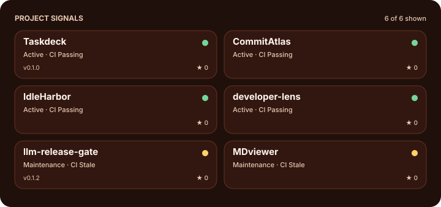
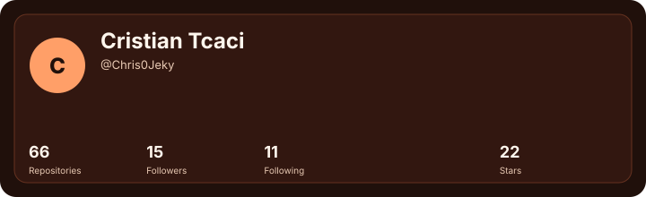
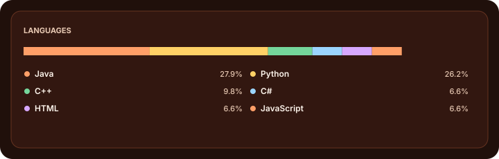

### Backend & platform engineer · Local-first developer tools · Trust-first automation

I build systems that make complex work reviewable, observable, and safe.

[Portfolio](https://chris0jeky.github.io/CV_and_Portfolio/) · [LinkedIn](https://www.linkedin.com/in/cristian-tcaci/) · [Email](mailto:jeky.tck@gmail.com) · [CommitAtlas Studio](https://commitatlas.jeky-tck.chatgpt.site/studio)

---

## Activity pulse

  
   
  

Live public activity surfaces update through their providers. CommitAtlas replacements are being built with scheduled, source-backed generation so the profile remains useful during that transition.

---

## Now building: Taskdeck

**[Taskdeck](https://github.com/Chris0Jeky/Taskdeck)** is a local-first, review-first action-item engine. It turns notes, emails, and checklists into source-linked proposals; you review the diff, then explicitly apply the changes.

- **Why it exists:** useful automation should preserve human control and provenance.
- **Core loop:** capture → proposal → review → apply.
- **Stack:** C# · .NET 8 · Vue 3 · TypeScript · SQLite.
- **Status:** public beta, with self-contained desktop builds in `v0.1.0`.

**[Download for Windows](https://github.com/Chris0Jeky/Taskdeck/releases/download/v0.1.0/taskdeck-v0.1.0-win-x64.zip)** · [Release notes](https://github.com/Chris0Jeky/Taskdeck/releases/tag/v0.1.0) · [Documentation](https://chris0jeky.github.io/Taskdeck/) · [Source](https://github.com/Chris0Jeky/Taskdeck)

---

## Project radar

  

This reliable project snapshot was rendered by **[CommitAtlas](https://github.com/Chris0Jeky/CommitAtlas)** from public GitHub data on **20 August 2026**. Project lifecycle is deliberately curated; CI is read only from each named workflow. Open the [live Studio](https://commitatlas.jeky-tck.chatgpt.site/studio) for current previews.

  
<strong>Public profile and language snapshot provenance</strong>

  

    
    
  

  These dated cards use public repository data only. Private contribution data is not requested or exposed.

## Selected work

| Project | What it demonstrates | Open it |
| --- | --- | --- |
| **Taskdeck** | Local-first product engineering and proposal-first automation | [Docs](https://chris0jeky.github.io/Taskdeck/) · [Download](https://github.com/Chris0Jeky/Taskdeck/releases/tag/v0.1.0) · [Source](https://github.com/Chris0Jeky/Taskdeck) |
| **CommitAtlas** | Accessible GitHub cards, honest CI/lifecycle signals, and a configurable portfolio Studio | [Live Studio](https://commitatlas.jeky-tck.chatgpt.site/studio) · [Source](https://github.com/Chris0Jeky/CommitAtlas) |
| **IdleHarbor** | A lightweight native Windows utility with explicit, visible idle prevention | [Source](https://github.com/Chris0Jeky/IdleHarbor) · [CI](https://github.com/Chris0Jeky/IdleHarbor/actions/workflows/ci.yml) |
| **Developer Lens** | Privacy-safe, local-first development analytics with a synthetic public showcase | [Showcase](https://chris0jeky.github.io/developer-lens/) · [Source](https://github.com/Chris0Jeky/developer-lens) |
| **LLM Release Gate** | Deterministic regression gates for prompt, model, retrieval, tool, and configuration changes | [v0.1.2](https://github.com/Chris0Jeky/llm-release-gate/releases/tag/v0.1.2) · [Source](https://github.com/Chris0Jeky/llm-release-gate) |
| **MDviewer** | Browser-based Markdown-to-PDF editing with live pagination | [Live app](https://mdviewer-c9r.pages.dev/) · [Source](https://github.com/Chris0Jeky/MDviewer) |

More systems and research: [WealthLens HQ](https://chris0jeky.github.io/wealthlens-hq/) · [RepoScope](https://github.com/Chris0Jeky/RepoScope) · [NavSentinel](https://github.com/Chris0Jeky/NavSentinel) · [N-person IPD simulation](https://github.com/Chris0Jeky/N-person-prisoners-dilemma-simulation)

---

## Proof and working principles

- Integrated automated security scanning into **~72 AWS CI/CD pipelines** using Jenkins, Bash, and Groovy.
- Published work on multi-agent simulation and game theory through the [N-person Prisoner's Dilemma project](https://github.com/Chris0Jeky/N-person-prisoners-dilemma-simulation).
- Build products end to end: architecture → tests and CI → release discipline → user experience.
- Treat reliability, security, accessibility, and honest unknown states as product features.
- Prefer local-first designs when they improve speed, privacy, ownership, and control.

  
<strong>Current toolkit</strong>

**Languages:** C# · TypeScript/JavaScript · Python · C++ · Bash/PowerShell · SQL

**Backend & platform:** .NET · Node.js · SQLite/Postgres · REST · MCP · Docker

**Frontend:** Vue 3 · React · Vite

**Delivery:** GitHub Actions · AWS · Jenkins · container workflows · automated security scanning

---

  <em>Interested in trustworthy developer tools, local-first systems, or practical platform engineering?</em>
   
  <a href="mailto:jeky.tck@gmail.com">Let’s talk.</a>
   
  

