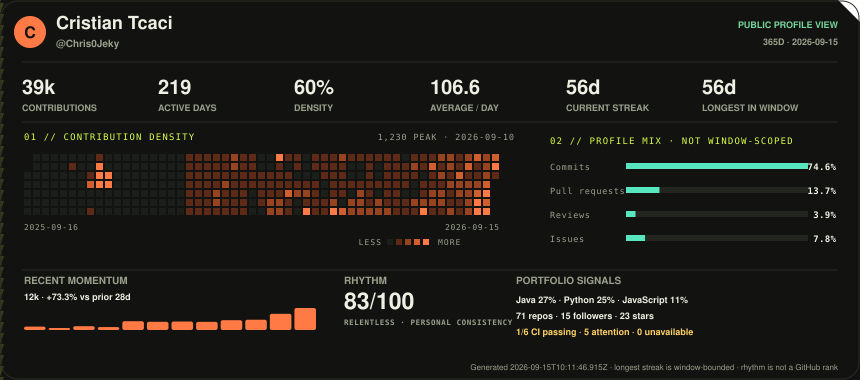
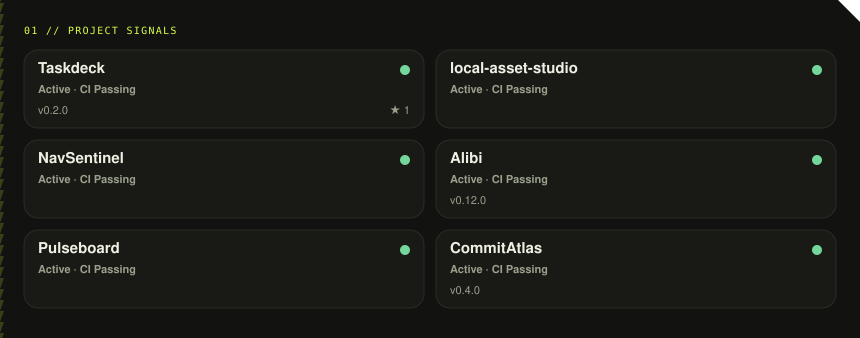
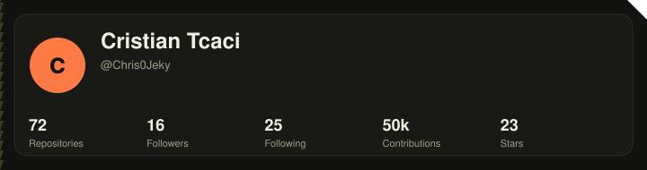
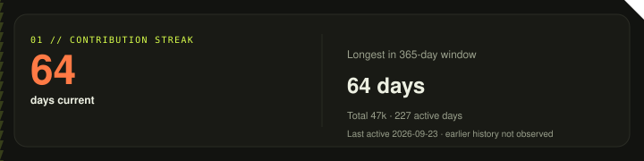
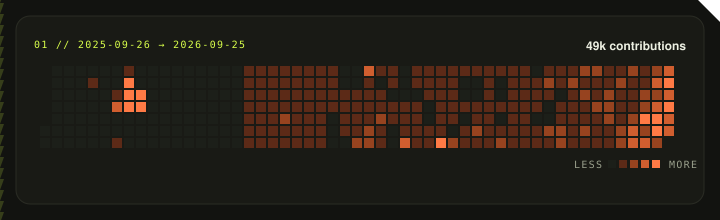
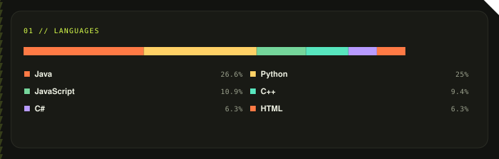

### Backend & platform engineer · Local-first developer tools · Trust-first automation

I build systems that make complex work reviewable, observable, and safe.

[Portfolio](https://chris0jeky.github.io/CV_and_Portfolio/) · [LinkedIn](https://www.linkedin.com/in/cristian-tcaci/) · [Email](mailto:jeky.tck@gmail.com) · [CommitAtlas Studio](https://commitatlas.jeky-tck.chatgpt.site/studio)

---

## GitHub operating picture

  <a href="https://commitatlas.jeky-tck.chatgpt.site/studio">
    <picture>
      <source media="(max-width: 600px)" srcset="./assets/commitatlas/atlas-compact.svg" />
      
    </picture>
  </a>

Public GitHub profile view · exact 365-day window · generated by CommitAtlas · scheduled daily · no credential or private repository detail requested · <a href="https://commitatlas.jeky-tck.chatgpt.site/studio">Open Studio</a> · <a href="https://github.com/Chris0Jeky/CommitAtlas">Source</a>

---

## Now building: Taskdeck

**[Taskdeck](https://github.com/Chris0Jeky/Taskdeck)** is a local-first, review-first action-item engine. It turns notes, emails, and checklists into source-linked proposals; you review the diff, then explicitly apply the changes.

- **Why it exists:** useful automation should preserve human control and provenance.
- **Core loop:** capture → proposal → review → apply.
- **Stack:** C# · .NET 8 · Vue 3 · TypeScript · SQLite.
- **Status:** public beta, with self-contained desktop builds in `v0.1.0`.

**[Download for Windows](https://github.com/Chris0Jeky/Taskdeck/releases/download/v0.1.0/taskdeck-v0.1.0-win-x64.zip)** · [Release notes](https://github.com/Chris0Jeky/Taskdeck/releases/tag/v0.1.0) · [Documentation](https://chris0jeky.github.io/Taskdeck/) · [Source](https://github.com/Chris0Jeky/Taskdeck)

---

## Project radar

  

Lifecycle is deliberately curated; CI is read only from each named workflow. All cards come from one
public snapshot, with its exact date window and SHA-256 hashes recorded in the
[generated manifest](./assets/commitatlas/manifest.json). A failed refresh keeps the last committed
good snapshot online.

  
<strong>Explore individual CommitAtlas widgets</strong>

  

    
    
     
    
     
    
  

  These cards use credential-free public GitHub evidence. The logged-out profile view may include
  anonymous aggregate activity the account elects to display; CommitAtlas requests no private
  repository names, commits, URLs, or other private details.

## Selected work

- **[Taskdeck](https://github.com/Chris0Jeky/Taskdeck)** — local-first proposal/review/apply automation · [Docs](https://chris0jeky.github.io/Taskdeck/) · [Download](https://github.com/Chris0Jeky/Taskdeck/releases/download/v0.1.0/taskdeck-v0.1.0-win-x64.zip) · [Release](https://github.com/Chris0Jeky/Taskdeck/releases/tag/v0.1.0)
- **[CommitAtlas](https://github.com/Chris0Jeky/CommitAtlas)** — first-party GitHub analytics and portfolio dashboards · [Studio](https://commitatlas.jeky-tck.chatgpt.site/studio) · [Docs](https://github.com/Chris0Jeky/CommitAtlas#readme)
- **[IdleHarbor](https://github.com/Chris0Jeky/IdleHarbor)** — explicit native Windows idle prevention · [CI](https://github.com/Chris0Jeky/IdleHarbor/actions/workflows/ci.yml)
- **[Developer Lens](https://github.com/Chris0Jeky/developer-lens)** — privacy-safe local development analytics · [Showcase](https://chris0jeky.github.io/developer-lens/)
- **[LLM Release Gate](https://github.com/Chris0Jeky/llm-release-gate)** — deterministic regression gates for AI changes · [v0.1.2](https://github.com/Chris0Jeky/llm-release-gate/releases/tag/v0.1.2)
- **[MDviewer](https://github.com/Chris0Jeky/MDviewer)** — live Markdown-to-PDF editing and pagination · [Live app](https://mdviewer-c9r.pages.dev/)

More systems and research: [WealthLens HQ](https://chris0jeky.github.io/wealthlens-hq/) · [RepoScope](https://github.com/Chris0Jeky/RepoScope) · [NavSentinel](https://github.com/Chris0Jeky/NavSentinel) · [N-person IPD simulation](https://github.com/Chris0Jeky/N-person-prisoners-dilemma-simulation)

---

## Proof and working principles

- Integrated automated security scanning into **~72 AWS CI/CD pipelines** using Jenkins, Bash, and Groovy.
- Published work on multi-agent simulation and game theory through the [N-person Prisoner's Dilemma project](https://github.com/Chris0Jeky/N-person-prisoners-dilemma-simulation).
- Build products end to end: architecture → tests and CI → release discipline → user experience.
- Treat reliability, security, accessibility, and honest unknown states as product features.
- Prefer local-first designs when they improve speed, privacy, ownership, and control.

  
<strong>Current toolkit</strong>

**Languages:** C# · TypeScript/JavaScript · Python · C++ · Bash/PowerShell · SQL

**Backend & platform:** .NET · Node.js · SQLite/Postgres · REST · MCP · Docker

**Frontend:** Vue 3 · React · Vite

**Delivery:** GitHub Actions · AWS · Jenkins · container workflows · automated security scanning

---

  <em>Interested in trustworthy developer tools, local-first systems, or practical platform engineering?</em>
   
  <a href="mailto:jeky.tck@gmail.com">Let’s talk.</a>
   
  

