<div align="center">

# 🚀 CRISTIAN TCACI 🚀
### aka Chris0Jeky | The Code Alchemist 🧪


[](https://chris0jeky.dev)
[](https://www.linkedin.com/in/cristian-chris-tcaci/)
[](mailto:Jeky.tck@gmail.com)
[](https://discord.com/users/Zangetsu(Chris-to_Kun)#1872)


</div>

---

<div align="center">
  
### 🌟 Welcome to My Digital Universe! 🌟
#### Where Code Meets Creativity and Innovation Knows No Bounds

</div>


### 👨‍💻 About Me

```python
class ChrisTcaci:
    def __init__(self):
        self.name = "Cristian (Chris) Tcaci"
        self.role = "Full-Stack Developer & ML Engineer"
        self.languages = ["Java ☕", "Python 🐍", "C++ ⚡", "JavaScript 🌐"]
        self.current_focus = "🔍 Seeking Software Engineering Opportunities"
        self.achievements = ["🏆 GE Impact Award Winner", "🧩 Google Foobar Challenger"]
        
    def say_hi(self):
        print("Thanks for dropping by! Let's build something amazing together! 🚀")

me = ChrisTcaci()
me.say_hi()
```

---

## 🏆 Trophy Cabinet

<div align="center">
  
### 🎖️ **GE IMPACT AWARD** 🎖️
**"DELIVER WITH FOCUS"**  
*Awarded by Simon Tutin, December 18, 2023*  
For exceptional contributions to the 533 Release and 2023 successes

</div>

---

## 🚀 Featured Projects

<div align="center">
  
### 🌟 **Project Showcase** 🌟

</div>

<table>
  <tr>
    <td width="50%">
      <h3 align="center">🤖 AI Analytics Platform</h3>
      <div align="center">
        <a href="https://github.com/Chris0Jeky/AI-Analytics-Platform](https://github.com/Chris0Jeky/CST3133-Advanced-Topics-in-Data-Science-and-Artificial-Intelligence">
          
        </a>
        <p>
          
          
        </p>
        <p><strong>ML Powerhouse:</strong> Dual-model system with student performance prediction & fake news detection</p>
      </div>
    </td>
    <td width="50%">
      <h3 align="center">🎵 C++ Audio Library</h3>
      <div align="center">
        <a href="https://github.com/Chris0Jeky/CPP-Audio-Library">
          
        </a>
        <p>
          
          
        </p>
        <p><strong>Lightning Fast:</strong> Thread-safe music library with fuzzy search & regex support</p>
      </div>
    </td>
  </tr>
  <tr>
    <td width="50%">
      <h3 align="center">📚 EduHub Platform</h3>
      <div align="center">
        <a href="https://github.com/Chris0Jeky/EduHub">
          
        </a>
        <p>
          
          
        </p>
        <p><strong>Full-Stack Magic:</strong> Modern education platform with real-time features</p>
      </div>
    </td>
    <td width="50%">
      <h3 align="center">🧠 SOAR IPD Research</h3>
      <div align="center">
        <a href="https://github.com/Chris0Jeky/SOAR-IPD-Thesis">
          
        </a>
        <p>
          
          
        </p>
        <p><strong>Cutting-Edge AI:</strong> Game theory meets cognitive science</p>
      </div>
    </td>
  </tr>
</table>

---

## 💻 Tech Arsenal

<div align="center">

### 🛠️ Languages & Frameworks
<p>
  
</p>

### ☁️ Cloud & DevOps
<p>
  
</p>

### 🗄️ Databases & Tools
<p>
  
</p>

</div>

---

## 📊 GitHub Analytics

<div align="center">
  
  
</div>

<div align="center">
  
</div>

---

## 🎯 Current Mission

```mermaid
graph LR
    A[🎓 CS Graduate] --> B[💼 Seeking Opportunities]
    B --> C[🚀 Full-Stack Development]
    B --> D[🤖 Machine Learning]
    B --> E[☁️ Cloud Architecture]
    C --> F[🌟 Your Next Team Member?]
    D --> F
    E --> F
```

<div align="center">
  


</div>

---

## 🤝 Let's Connect!

<div align="center">

### 💬 Open for Opportunities, Collaborations, and Cool Projects!


**Currently crafting code and seeking my next adventure in tech!**

<a href="mailto:Jeky.tck@gmail.com">
  
</a>

</div>

---

<div align="center">
  
### 🌈 Fun Facts


🧩 **Google Foobar Challenge Conqueror**  
🏢 **DeliveraSoft Consultancy Founder**  
🧠 **Tech + Philosophy + Psychology Enthusiast**  
🚀 **Always Learning, Always Building**

</div>

---

<div align="center">
  
</div>

<!-- Hidden Analytics -->
<div align="center">
  
</div>
